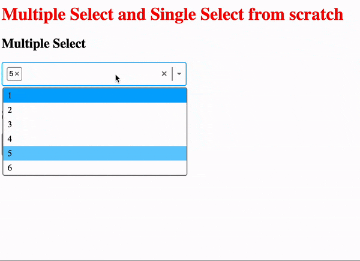

# vite-react-intermediate-project
An Intermediate Vitereact ts app completely build from scratch where user can select multiple value or single value from select dropdown and also with keyboard keys.  

See Gif attached for better visualisation

## clone the repo
Run the following commands
* `npm i `
* `npm run dev` 

## Gif of Select Dropdwon

